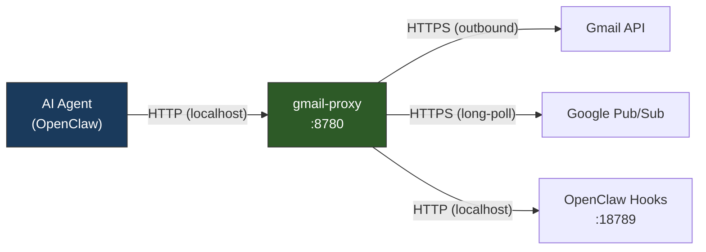
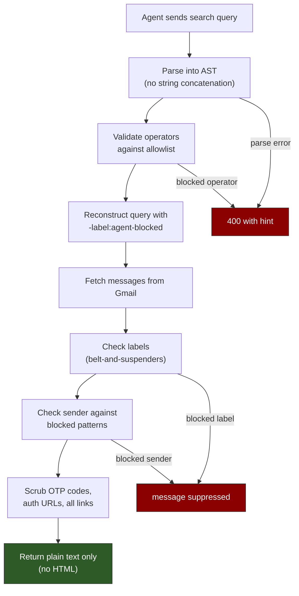

# gmail-proxy

A single Rust binary that provides secure, read-only, content-scrubbed Gmail access for AI agents. Built for [OpenClaw](https://github.com/anthropics/openclaw) but usable with any agent framework that can make HTTP requests.

## The Problem

AI agents with email access can intercept MFA codes, password reset links, and magic sign-in URLs — effectively bypassing 2FA for any account the user has. Giving an agent a Gmail OAuth token is like handing it the keys to every other account.

## How It Works

The proxy sits between the AI agent and Gmail. It holds the OAuth credentials, enforces label-based filtering, scrubs sensitive content from message bodies, and exposes only sanitized data over a local HTTP API. The agent never has Gmail credentials and cannot bypass the proxy.



No inbound connections from the internet. The proxy only makes outbound HTTPS requests to Google APIs and local HTTP requests to OpenClaw.

### Security Layers



**Query security**: Agent search queries are parsed into an AST, validated against an operator allowlist, and reconstructed with the label exclusion at the top level. No string concatenation — the agent cannot craft a query that bypasses the label filter.

**Content scrubbing**: Message bodies are scanned for OTP patterns, auth/reset URLs, and blocked sender patterns. Matches are redacted inline (`[REDACTED]`) or the entire message is suppressed. Optionally, all URLs are stripped.

**Credential isolation**: The OAuth refresh token is stored in a separate `secrets.toml` with 0600 permissions, owned by a dedicated service user. The agent process cannot read it.

**Scope restriction**: OAuth scope is `gmail.readonly` + `pubsub` only. The token physically cannot write to Gmail.

### Real-Time Notifications

The proxy uses a Pub/Sub **pull** subscription with long-polling — no inbound webhooks needed. When new emails arrive, the proxy fetches them, scrubs them, and forwards the sanitized content to OpenClaw's hook endpoint.

## Quick Start

### Prerequisites

- Rust toolchain (1.75+)
- A GCP project with Gmail API and Pub/Sub API enabled
- OAuth 2.0 client credentials (Desktop app type)

### 1. GCP Setup (one-time)

```bash
# Enable APIs
gcloud services enable gmail.googleapis.com pubsub.googleapis.com

# Create OAuth credentials
# Console: https://console.cloud.google.com/apis/credentials
# Create Credentials > OAuth client ID > Desktop app
# Download the client_secret_*.json file

# Create Pub/Sub topic and subscription
gcloud pubsub topics create gmail-watch

gcloud pubsub topics add-iam-policy-binding gmail-watch \
  --member=serviceAccount:gmail-api-push@system.gserviceaccount.com \
  --role=roles/pubsub.publisher

gcloud pubsub subscriptions create gmail-proxy-pull \
  --topic=gmail-watch \
  --ack-deadline=60
```

### 2. Gmail Setup (one-time)

1. Create a label called `agent-blocked` in Gmail
2. Create filters to auto-apply `agent-blocked` to security-sensitive senders:
   - `from:noreply@google.com subject:(verify OR "security alert" OR "sign-in")`
   - `from:no-reply@accounts.google.com`
   - Other 2FA/auth senders as needed

### 3. Install & Configure

```bash
# Build
cargo build --release

# User-level install (no root needed)
./target/release/gmail-proxy install

# Edit config with your GCP project details
vim ~/.config/gmail-proxy/config.toml

# OAuth setup (opens browser)
./target/release/gmail-proxy setup --client-json ~/Downloads/client_secret_*.json

# Install the OpenClaw skill (teaches the agent how to use the proxy)
./target/release/gmail-proxy install-skill --workspace ~/.openclaw/workspace
```

> **Note**: If your GCP project is in "testing" mode, add your email as a test user in the OAuth consent screen settings.

### 4. Run

```bash
# Foreground (for testing)
gmail-proxy serve

# Or as a service:
#   Linux:  systemctl --user enable --now gmail-proxy
#   macOS:  launchctl load ~/Library/LaunchAgents/com.gmail-proxy.plist
```

### 5. Test

```bash
curl -s http://127.0.0.1:8780/health | jq .
curl -s 'http://127.0.0.1:8780/search?q=is:unread&max=5' | jq .
curl -s http://127.0.0.1:8780/message/MESSAGE_ID | jq .
```

## API

### `GET /search?q={query}&max={n}&page_token={token}`

Search emails. The query is parsed, validated, and reconstructed with `-label:agent-blocked` before being sent to Gmail.

| Parameter | Required | Default | Description |
|-----------|----------|---------|-------------|
| `q` | yes | — | Gmail search query |
| `max` | no | 20 | Results per page (max 100) |
| `page_token` | no | — | Pagination token from previous response |

**Response:**
```json
{
  "messages": [
    {
      "id": "abc123",
      "thread_id": "def456",
      "from": "sender@example.com",
      "to": "you@gmail.com",
      "subject": "Invoice #1234",
      "date": "2026-03-14T10:30:00Z",
      "snippet": "Please find attached...",
      "body_text": "Full plain text body with sensitive content redacted...",
      "labels": ["INBOX", "CATEGORY_UPDATES"],
      "has_attachments": true
    }
  ],
  "next_page_token": "...",
  "result_size_estimate": 250
}
```

### `GET /message/{id}`

Fetch a single message. Returns 404 if the message is blocked.

### `GET /thread/{id}`

Fetch a thread. Blocked messages within the thread are omitted.

### `GET /health`

Returns proxy status including watch registration, token validity, and poller health.

### Query Syntax

Standard Gmail search operators are supported:

| Operator | Example | Description |
|----------|---------|-------------|
| `from:` | `from:alice@example.com` | Sender |
| `to:`, `cc:`, `bcc:` | `to:bob` | Recipients |
| `subject:` | `subject:"project update"` | Subject line |
| `has:` | `has:attachment` | Message properties |
| `is:` | `is:unread` | Message state |
| `newer_than:` | `newer_than:7d` | Relative time |
| `after:`, `before:` | `after:2026/01/01` | Absolute dates |
| `filename:` | `filename:pdf` | Attachment name |

**Restricted** (blocked by the proxy):
- `label:` — managed by the proxy for security filtering
- `is:draft` — drafts are not accessible
- `in:trash`, `in:spam`, `in:anywhere` — restricted locations

## Configuration

### `config.toml`

```toml
[auth]
client_id = "123456.apps.googleusercontent.com"
client_secret = "GOCSPX-..."
secrets_file = "secrets.toml"

[gmail]
account = "you@gmail.com"
pubsub_topic = "projects/my-project/topics/gmail-watch"
pubsub_subscription = "projects/my-project/subscriptions/gmail-proxy-pull"
watch_labels = ["INBOX"]
watch_renew_secs = 518400  # 6 days (watch expires at 7)

[scrub]
blocked_label = "agent-blocked"
strip_links = true
otp_patterns = [
  "\\b\\d{4,8}\\b",
  "(?i)verification code[:\\s]+\\S+",
  "(?i)(one.time|temporary|security)\\s+(code|password|pin)",
]
blocked_sender_patterns = [
  "(?i)noreply@.*\\.google\\.com",
  "(?i)no-reply@accounts\\.google\\.com",
  "(?i)security@",
]
url_strip_patterns = [
  "(?i)https?://[^\\s]*/(reset|verify|confirm|auth|signin|login|activate)[^\\s]*",
]
allowed_operators = [
  "from", "to", "cc", "bcc", "subject",
  "has", "is", "in", "filename", "list", "deliveredto",
  "newer_than", "older_than", "after", "before",
  "category", "size", "larger", "smaller",
  "rfc822msgid",
]

[proxy]
bind = "127.0.0.1:8780"

[openclaw]
hook_url = "http://127.0.0.1:18789/hooks/gmail"

[audit]
log_dir = "/var/log/gmail-proxy"
```

All scrubbing patterns are configurable regex. Add patterns for your environment as needed.

### `secrets.toml`

```toml
refresh_token = "1//0eXyz..."
openclaw_hook_token = "..."
```

This file is generated by `gmail-proxy setup` and should be owned by the service user with 0600 permissions.

## Project Structure

```
src/
├── main.rs              # CLI (clap), dispatch to subcommands
├── config.rs            # Config + secrets loading, permission checks
├── auth.rs              # OAuth token manager + setup flow
├── audit.rs             # Structured audit logging (JSONL)
├── install.rs           # Install subcommand (user/system level)
├── gmail/
│   ├── client.rs        # Gmail API client (search, messages, threads, labels, watch, history)
│   ├── types.rs         # Serde types for Gmail API + sanitized output
│   └── watch.rs         # Watch registration + auto-renewal
├── scrub/
│   ├── query.rs         # Gmail query parser, AST, validation, reconstruction
│   ├── content.rs       # OTP/URL redaction, sender blocking, link stripping
│   └── labels.rs        # Label-based message filtering
├── proxy/
│   └── routes.rs        # Axum HTTP API (search, message, thread, health)
└── poller/
    ├── pubsub.rs        # Pub/Sub pull client (long-polling)
    └── processor.rs     # Notification processing, scrubbing, OpenClaw forwarding
```

## Audit Logging

Every agent interaction is logged as structured JSON to daily-rotated files (`audit-YYYY-MM-DD.jsonl`). Logged events include searches, message reads, thread reads, and rejected queries. Message body content is never logged — only metadata (from, subject, message IDs).

## License

MIT
